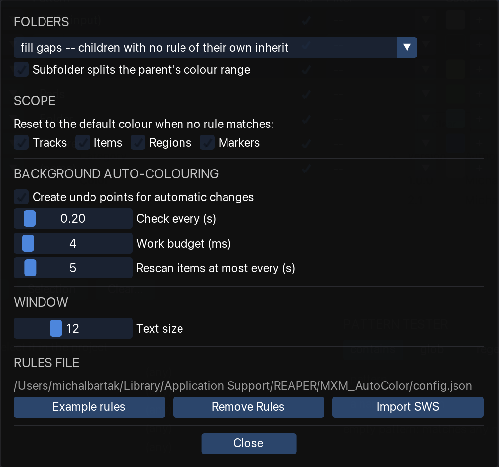

Everything that is not a rule lives in **Options**, at the right-hand end of the action bar. The
settings are global: one rule set, one set of options, shared by every project.

<figure class="shot">

<figcaption>Options</figcaption>
</figure>

## Folders

How a folder's colour reaches its children. See
[Folder colours](/Reaper-AutoColor/usage/colours/#folders).

| Setting | Meaning |
|---|---|
| **fill gaps** *(default)* | Children with no rule of their own inherit. |
| **force** | The folder colour overrides its children. |
| **off** | Folders do not colour their children. |

**Subfolder splits the parent's colour range**, on by default, affecting only rules that
[spread a gradient across **folders**](/Reaper-AutoColor/usage/colours/#gradients). A nested folder
ends the range around it, so the tracks after it start the ramp again rather than resuming it; a
top-level folder does the same to the tracks around it. Off gives one ramp per folder, however deep
the nesting. Note the case of a folder made mostly of subfolders: a range of one track shows the
first colour only.

## Scope

**Reset to the default colour when no rule matches**, one checkbox per kind — Tracks, Items, Regions,
Markers, Icons. Off everywhere by default. For Icons it removes the icon. See
[Reset unmatched objects](/Reaper-AutoColor/usage/clearing/#reset-unmatched-objects).

:::tip
Recommended for **items**, where it makes an item follow its track live. Note the effect on
**tracks**, where it also strips hand-set colours.
:::

## Background auto-colouring

| Setting | Default | What it does |
|---|---|---|
| **Create undo points for automatic changes** | off | Adds an undo point per automatic recolour. Off by default, to keep a rename from shredding the undo history; the rules can always re-derive the colours. |
| **Check every (s)** | 0.20 | How often the loop wakes. |
| **Work budget (ms)** | 4 | How long it may work before yielding back to REAPER. |
| **Rescan items at most every (s)** | 5 | The delay before an item *renamed in place* is noticed. `0` re-reads everything on every change. |

[Auto-apply](/Reaper-AutoColor/usage/auto-apply/) explains what the loop re-reads and why the rescan
interval exists.

## Window

**Text size**, 8 to 20. Every dimension in the window is a multiple of the font size, so this scales
the whole layout rather than just the labels.

The dialog stays **open** across an application switch, or a click elsewhere in REAPER. It closes on
its **Close** button, `Escape`, or a click on the AutoColor window behind it.

## Config file

Shows the path to [`config.json`](/Reaper-AutoColor/configuration/config-file/), and three buttons
that act on the **whole** rule set, every tab rather than the open one alone:

| Button | What it does |
|---|---|
| **Example rules** | Replaces everything with the built-in set, as written on first run. |
| **Remove Rules** | Empties every tab. |
| **Import from SWS** | Appends the rules from SWS Auto Color below the existing ones. |

All three ask for confirmation — the import lists what it found first — and **Undo** takes any of
them back while the window is open.

See **[Importing from SWS](/Reaper-AutoColor/configuration/import-sws/)** for what the import
reads, what comes across exactly, and what arrives switched off.

## Where to go next

- [Config file](/Reaper-AutoColor/configuration/config-file/) — what is stored, where, and what happens when it goes wrong.
- [Importing from SWS](/Reaper-AutoColor/configuration/import-sws/) — bringing SWS Auto Color rules across.
- [REAPER preferences](/Reaper-AutoColor/configuration/reaper-preferences/) — two settings outside this tool that decide what is visible.
