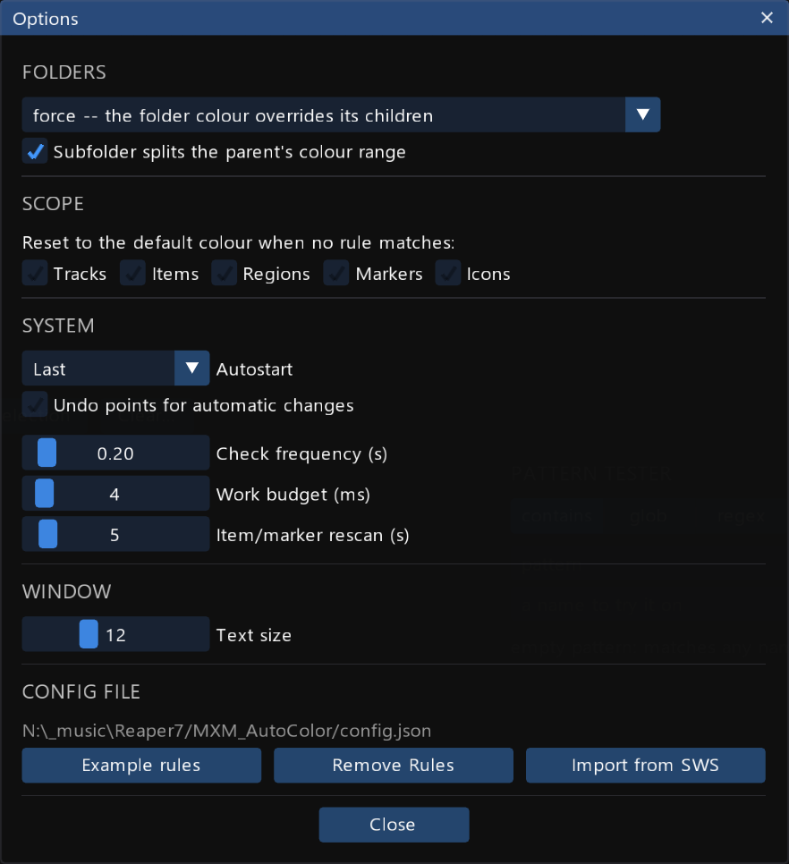

Everything that is not a rule lives in **Options**, at the right-hand end of the action bar. Options are global, shared by every project, like the rules.

<figure class="shot">

<figcaption>Options</figcaption>
</figure>

## Folders

How a folder's colour reaches its children. See [Folder colours](/Reaper-AutoColor/usage/colours/#folders).

| Setting | Meaning |
|---|---|
| **fill gaps** *(default)* | Children with no rule of their own inherit. |
| **force** | The folder colour overrides its children. |
| **off** | Folders do not colour their children. |

**Subfolder splits the parent's colour range**, on by default, affecting only rules that [spread a gradient across **folders**](/Reaper-AutoColor/usage/colours/#gradients). A nested folder ends the range around it, so the tracks after it start the ramp again rather than resuming it; a top-level folder does the same to the tracks around it. Off gives one ramp per folder, however deep the nesting. A folder made mostly of subfolders can end up in one colour; see [Subfolders](/Reaper-AutoColor/usage/colours/#subfolders).

## Scope

**Reset to the default colour when no rule matches**, one checkbox per object type — Tracks, Items, Regions, Markers, Icons. Off everywhere by default. For Icons it removes the icon. See [Reset unmatched objects](/Reaper-AutoColor/usage/clearing/#reset-unmatched-objects).

:::tip
Recommended for **items**, to make them follow their track. On **tracks** it also removes colours set by hand.
:::

## System

| Setting | Default | What it does |
|---|---|---|
| **Autostart** | Last | Whether auto-apply starts with REAPER: *Never*, *Always*, or *Last* — the state REAPER was closed in. [Auto-apply](/Reaper-AutoColor/usage/auto-apply/#starting-with-reaper) covers the `__startup.lua` entry it relies on. |
| **Undo points for automatic changes** | off | Adds an undo point per automatic recolour. Off by default, to keep renames from filling the undo history. |
| **Check frequency (s)** | 0.20 | How often the project is checked: the only delay before a track rename is picked up. |
| **Work budget (ms)** | 4 | How long one check may spend on items, regions and markers. The rest carries over to the next check. |
| **Item/marker rescan (s)** | 5 | The delay before an item, region or marker *renamed in place* is noticed. `0` re-reads them on every change. See [Auto-apply](/Reaper-AutoColor/usage/auto-apply/#what-it-re-reads-and-when). |

## Window

**Text size**, 8 to 20. Scales the whole window, not only the labels.

The dialog stays **open** across an application switch, or a click elsewhere in REAPER. It closes on its **Close** button, `Escape`, or a click on the AutoColor window behind it.

## Config file

Shows the path to [`config.json`](/Reaper-AutoColor/configuration/config-file/), and three buttons that act on **every** tab, not only the open one:

| Button | What it does |
|---|---|
| **Example rules** | Replaces everything with the built-in set, as written on first run. |
| **Remove Rules** | Empties every tab. |
| **Import from SWS** | Appends the rules from SWS Auto Color below the existing ones. |

All three ask for confirmation — the import lists what it found first — and **Undo** takes any of them back while the window is open.

See **[Importing from SWS](/Reaper-AutoColor/configuration/import-sws/)** for what the import reads, what comes across exactly, and what arrives switched off.

## Where to go next

- [Config file](/Reaper-AutoColor/configuration/config-file/) — what is stored, where, and what happens when it goes wrong.
- [Importing from SWS](/Reaper-AutoColor/configuration/import-sws/) — bringing SWS Auto Color rules across.
- [REAPER preferences](/Reaper-AutoColor/configuration/reaper-preferences/) — two settings outside this tool that decide what is visible.
