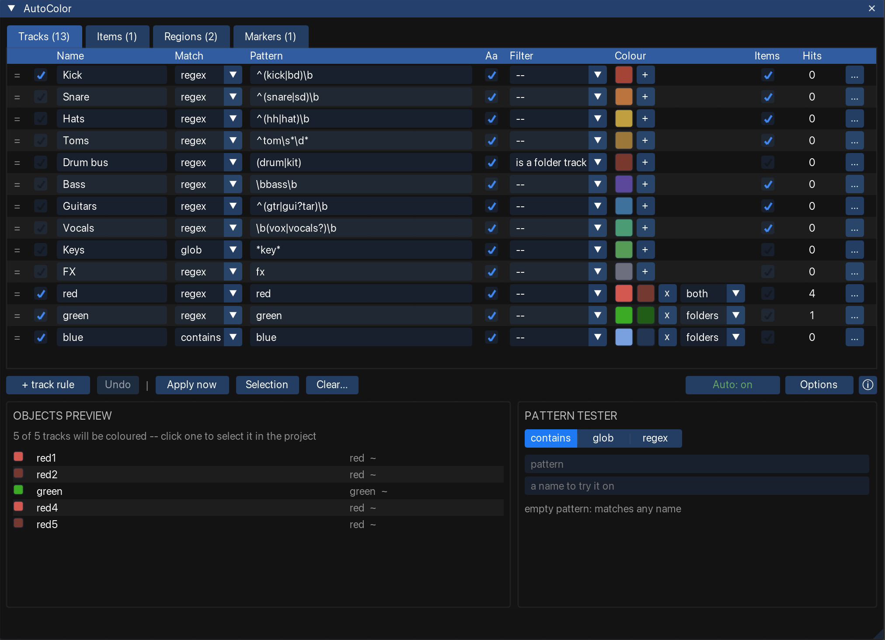

AutoColor colours **tracks, items, regions and markers** from their **names**. Match with a plain
substring, a glob, or a real regular expression.

Write the rules once and every project follows them. A track called `Sub Bass DI` goes purple as
soon as it is named, and the items on it follow.

<figure class="shot">

<figcaption>The configuration window</figcaption>
</figure>

## Main features

- **One ordered list per object kind.** Tracks, Items, Regions and Markers each have a tab. Within
  a tab the first rule that matches wins, like firewall rules.
- **Three match modes.** `contains`, `glob` and full `regex`, per rule.
- **Non-name filters.** Narrow a rule to folder tracks, tracks inside a folder, or unnamed objects.
- **Gradients.** Give a rule a second colour and its matches spread along a ramp, grouped by runs,
  by folders, or not at all.
- **Items follow their track.** A track rule can colour the items on it, whatever they are called.
- **Background auto-colouring.** A loop keeps the project in step as you rename. It adds no undo
  points and never reverts a colour you set by hand.
- **Live preview.** Every rule shows its hit count, and the panes at the foot of the window list the
  objects it claims in this project.

:::tip[SWS Auto Color]
SWS matches case-insensitive substrings only, and has no item support.
[Matching names](/Reaper-AutoColor/usage/matching/) covers what the three modes do differently. Do
not run both at once — see [Troubleshooting](/Reaper-AutoColor/troubleshooting/).
:::

## How a colour is decided

1. AutoColor tests the object's name against the rules on **its own tab**, top to bottom.
1. The **first** rule that matches wins. Its colour becomes the object's colour.
1. If that rule has a second colour, the object's shade comes from its place in the
   [gradient](/Reaper-AutoColor/usage/colours/#gradients).
1. An item that no item rule claims can take its **track's** colour, if the track's rule says to
   [cascade](/Reaper-AutoColor/usage/colours/#items).
1. A track that no rule claims can inherit from its **folder parent**, depending on the
   [folder setting](/Reaper-AutoColor/usage/colours/#folders).
1. Otherwise the object is left alone, unless you asked for unmatched objects of that kind to be
   [reset](/Reaper-AutoColor/usage/clearing/#reset-unmatched-objects).

Nothing reaches the project until you **Apply**, or the background loop runs.

## Where to go next

- [Requirements](/Reaper-AutoColor/requirements/) — the REAPER version and the one extension you need.
- [Installation](/Reaper-AutoColor/installation/) — install through ReaPack, or copy the folder in by hand.
- [The configuration window](/Reaper-AutoColor/usage/) — the tabs, the rule row, the action bar.
- [Matching names](/Reaper-AutoColor/usage/matching/) — modes, supported regex, filters.
- [Auto-apply](/Reaper-AutoColor/usage/auto-apply/) — the background loop and what it refuses to touch.
- [Troubleshooting](/Reaper-AutoColor/troubleshooting/) — when the colour is not what you expected.
