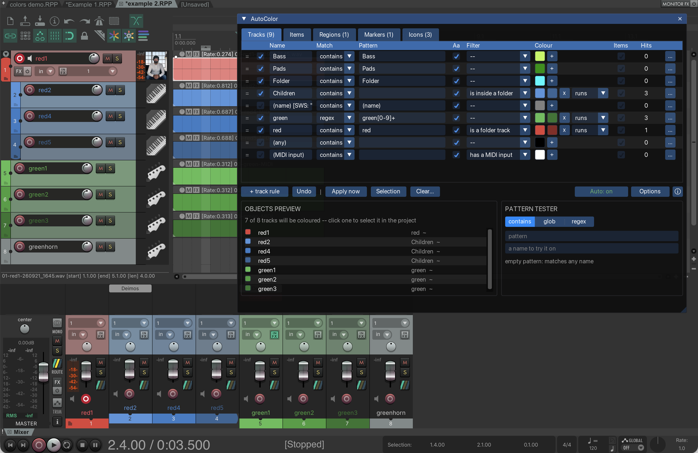

AutoColor is a REAPER script that colours **tracks, items, regions and markers** according to their names. It can also set **track icons** the same way. For example, every track whose name contains `kick` can be coloured red, and every track whose name contains `vox` green, without picking either colour by hand.

You describe which names get which colour once. AutoColor then colours every matching track, item, region and marker in the project, and can keep doing so as you add and rename them.

<figure class="shot">

<figcaption>The configuration window</figcaption>
</figure>

:::tip[Coming from SWS Auto Color]
SWS Auto Color matches names by case-insensitive substring only, and does not colour items. AutoColor offers three ways to match a name, including regular expressions, and colours items as well. [Matching names](/Reaper-AutoColor/usage/matching/) explains the three ways. An existing SWS setup can be brought across with [Import from SWS](/Reaper-AutoColor/configuration/import-sws/).

Do not run SWS Auto Color and AutoColor at the same time; see [Colours keep changing back](/Reaper-AutoColor/troubleshooting/#colours-keep-changing-back).
:::

## Concepts

**Object type.** AutoColor works on four object types: tracks, items, regions and markers. In this documentation, an *object* is any track, item, region or marker. Each object type has its own tab in the configuration window. Track icons have a fifth tab, **Icons**.

**Rule.** A rule pairs a name pattern with a colour, or on the Icons tab with an icon. For example, a rule with the pattern `vox` and the colour green colours every track whose name contains `vox` green.

**Match.** A rule matches an object when the object's name fits the rule's pattern. A rule can also have a **filter**, an extra condition that does not depend on the name, such as "is a folder track". When a rule has a filter, the object must also meet that condition.

**Rule order.** The rules on each tab form an ordered list. AutoColor tests an object against the rules on its own tab from top to bottom, and the first rule that matches decides the colour. Rules further down the list are not considered for that object. To give one rule precedence over another, move it higher in the list.

**Applying.** Editing a rule does not change the project by itself. AutoColor writes colours and icons into the project when the rules are **applied**. You apply the rules by clicking **Apply now** in the configuration window, or by running one of the apply actions.

**Auto-apply.** When auto-apply is on, AutoColor applies the rules automatically whenever the project changes, for example when a track is added or renamed. While auto-apply is running, it does not overwrite a colour or icon that you set by hand. See [Colours and icons set by hand](/Reaper-AutoColor/usage/auto-apply/#colours-and-icons-set-by-hand).

**Rules are shared, colours are saved per project.** There is one set of rules, shared by every project. The colours and icons that the rules set are saved in each project, like any colour set by hand.

## Main features

- **Automatic colouring.** With [auto-apply](/Reaper-AutoColor/usage/auto-apply/) on, new and renamed objects are coloured as you work.
- **Three match modes per rule.** `contains` finds text anywhere in the name. `glob` compares the entire name against a pattern with wildcards such as `*`. `regex` uses a regular expression.
- **Filters that do not depend on the name.** A track rule can be limited to folder tracks, tracks inside a folder, tracks with an instrument, tracks with a MIDI input, or tracks with receives. A rule on any tab can be limited to objects that have no name. See [Filters](/Reaper-AutoColor/usage/matching/#filters).
- **Gradients.** A rule with a second colour gives its matches a range of shades between the two colours. The range can restart in each folder, or after each interruption by an object the rule does not match. See [Gradients](/Reaper-AutoColor/usage/colours/#gradients).
- **Items in their track's colour.** A track rule can also colour the items on the matching tracks, whatever those items are called. See [Items and their track's colour](/Reaper-AutoColor/usage/items/#items-and-their-tracks-colour).
- **Live preview.** Before anything is applied, the window lists the objects each rule matches and the colour each object will get, and shows how many objects each rule colours.

## How a colour is decided

[How a rule's colour is chosen](/Reaper-AutoColor/usage/colours/#how-a-rules-colour-is-chosen) describes, step by step, how AutoColor decides the colour of each object. Track icons are decided in the same way, by the rules on the Icons tab, independently of the track's colour.

## Limitations

- The master track is never coloured, because REAPER does not show a custom colour on it. See [The master track is never coloured](/Reaper-AutoColor/troubleshooting/#the-master-track-is-never-coloured).
- Takes have no rules of their own, and AutoColor removes take colours from the items it colours. See [Takes](/Reaper-AutoColor/usage/items/#takes).

## Where to go next

- [Requirements](/Reaper-AutoColor/requirements/): the REAPER version and the ReaImGui extension that the configuration window needs.
- [Installation](/Reaper-AutoColor/installation/): installing through ReaPack, or copying the files by hand.
- [The configuration window](/Reaper-AutoColor/usage/): the tabs, the rule list, the preview and the buttons.
- [Track colours](/Reaper-AutoColor/usage/tracks/): the first tab, and a quick way into what rules do.
- [Matching names](/Reaper-AutoColor/usage/matching/): the three match modes, the supported regular expressions, and the filters.
- [Auto-apply](/Reaper-AutoColor/usage/auto-apply/): keeping the project coloured automatically, and what auto-apply leaves alone.
- [Troubleshooting](/Reaper-AutoColor/troubleshooting/): what to check when an object does not get the expected colour.
