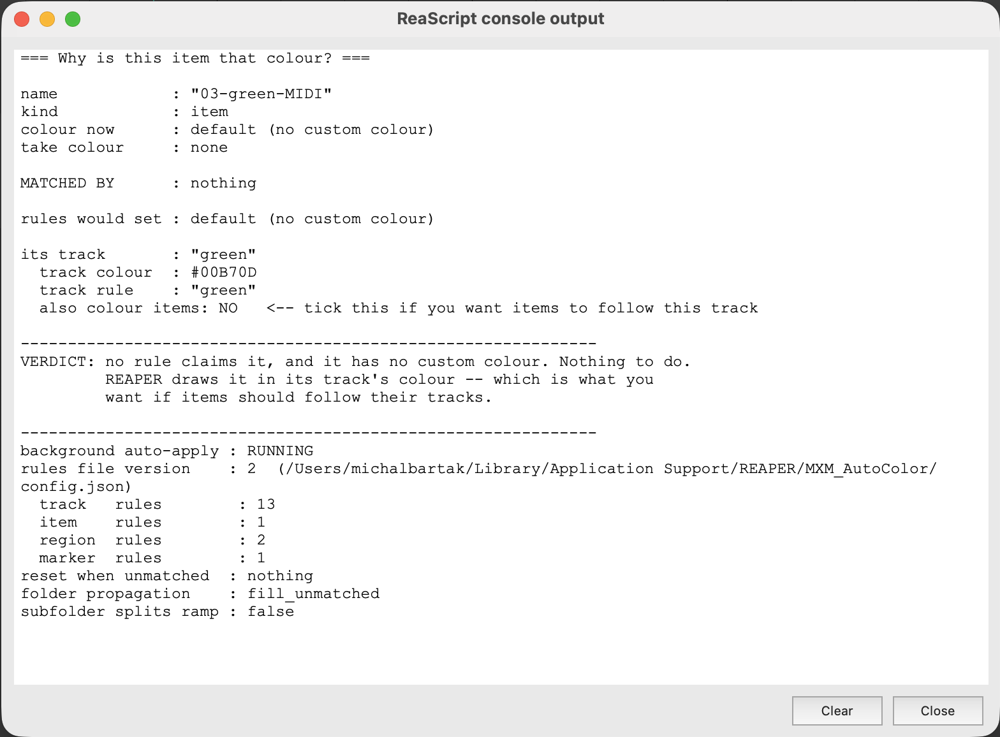

## Start here: why this colour?

Select the track or item and run `MXM_AutoColor_WhyThisColour.lua`. One console readout covers the
whole question: which rule claimed the object, what the rules would set, whether anything is
currently applying, and why an old colour survived.

<figure class="shot">

<figcaption>MXM_AutoColor_WhyThisColour.lua</figcaption>
</figure>

## Nothing visibly changed, but it says it coloured things

Almost always a REAPER display setting rather than the tool:

1. **Item colours are not drawn.** *Preferences → Appearance → Peaks/Waveforms* — tick **Item color**
   for background, peaks, or both. See
   [REAPER preferences](/Reaper-AutoColor/configuration/reaper-preferences/).
1. **A take colour is winning.** Take beats item. To confirm, give one item a custom colour and its
   take a different one; the visible one is what this build draws.
1. **The theme overrides it.** REAPER's own tooltip warns that a colour theme may override the tint
   preference.

## Colours keep changing back

Two live colour engines are fighting. A banner appears whenever SWS's auto-colour is on.

Switch one off — *SWS → Auto Color/Icon/Layout* — keeping the rules in one place.
**Options ▸ Rules file ▸ Import from SWS** moves them here first; see
[Importing from SWS](/Reaper-AutoColor/configuration/import-sws/).

## A rule shows 0 hits

**Hits** counts what a rule *wins*, not what its pattern matches:

- An **earlier rule on the same tab** claimed those objects; move this one up.
- The mode is **glob** and the pattern is not wrapped in `*`. Globs are anchored to the whole name,
  so `bass` matches a track named exactly "bass". `*bass*`, or **contains**, is the fix.
- A **filter** is narrowing it. The filter and the pattern must both hold.
- The rule is **switched off**, or every rule on the tab is. The tab says so.

The **Pattern tester** at the foot of the window settles it: same mode, the pattern and the name
pasted in, and it reports whether the pattern matches at all.

## "This pattern is too slow"

The rule exceeded its step budget and is treated as a no-match, rather than being allowed to freeze
REAPER. Nested quantifiers — `(a+)+$` and similar — are the usual cause; the same intent usually has
a linear form.

## A hand-picked colour came back / did not come back

The background loop **never reverts a hand-set colour**. Once an object's colour stops matching what
the tool last wrote, the loop leaves that object alone until the next rename.

**Apply now**, or `MXM_AutoColor_ApplyAll.lua`, hands the object back: it drops the marks the loop
holds, returning every object to the rules.

## The Auto button says "off" and will not start

Run `MXM_AutoColor_AutoToggle.lua` once from the Action List. Until REAPER has run it, the script
does not know its own command ID and the button can only report state. After that it starts and
stops the loop.

## An item renamed in place did not recolour

Items and regions are re-read on a timer — **Rescan items at most every (s)**, 5 s by default —
because REAPER reports only one project-wide "something changed" counter, and re-reading every item
on every change is expensive. Renaming in place is the one edit nothing cheaper detects. A lower
interval, or **Apply now**, resolves it. See
[Auto-apply](/Reaper-AutoColor/usage/auto-apply/#what-it-re-reads-and-when).

## A change to the scripts did nothing

The window and the auto-toggle hold their Lua state for as long as they run. After editing anything
under `Scripts/MXM_AutoColor/lib/`:

1. Close the configuration window and re-run it.
1. Toggle auto **off and on** again.

One-shot actions pick up changes immediately.

## Marker and region colours will not clear

On REAPER older than **7.62** the marker/region *clear* path is unavailable: `SetProjectMarker4`
reads colour 0 as "leave unchanged". Colouring still works, and the scripts report how many
markers/regions were skipped.

## The master track is never coloured

REAPER does not honour a custom colour on the master, through this tool or through REAPER's own
track-colour action, so it is not scanned at all.

## The rules are gone

Next to [`config.json`](/Reaper-AutoColor/configuration/rules-file/):

| File | Meaning |
|---|---|
| `config.bak.json` | The previous version. Rename it over `config.json` with the window closed. |
| `config.bad.json` | The file was unreadable and was parked here rather than lost. |

The window also has **Undo** for rule changes, as long as it is still open.

## The window says nothing will be saved

A **newer** version of the tool wrote the rule file. Editing is allowed, for inspection, but nothing
is written back — an older build must not rewrite a config it does not understand. Update the
scripts.

## Diagnostics

| Script | What it reports |
|---|---|
| `MXM_AutoColor_WhyThisColour.lua` | For a selected track or item: which rule claimed it, what the rules would set, whether anything is applying, and why an old colour survived |
| `MXM_AutoColor_Dump.lua` | Every track, item, region and marker with its name, GUID and current colour |
| `MXM_AutoColor_RunTests.lua` | The self-test, printed to the ReaScript console |

For the background loop, ExtState `MXM_AutoColor` / `auto_debug` set to `1` reports to the
console.

:::note[Probes that do not ship]
The repository's `dev/` folder holds a few more: a take-colour probe, a focus probe, and one that
builds a scratch project covering the awkward cases. Author tools, deliberately excluded from the
package, so they are not in a REAPER install — available by cloning the repository.
:::

## Known limitations

* Case-insensitive matching folds **ASCII only** — `(?i)` will not equate `Č` and `č`. Byte classes
  do accept non-ASCII, so `\w+` matches `Kytara_hlavní`.
* A pathological pattern (`(a+)+$` and friends) is cut off by a step budget rather than being
  allowed to hang REAPER — see [“This pattern is too slow”](#this-pattern-is-too-slow).
* On REAPER older than 7.62 the marker and region *clear* path is unavailable; colouring still
  works. See [Marker and region colours will not clear](#marker-and-region-colours-will-not-clear).
* The master track is never scanned or coloured, because REAPER does not honour a custom colour on
  it. See [The master track is never coloured](#the-master-track-is-never-coloured).
* **No rules for takes.** Take names are auto-derived from the track (`$tracknumber-$track` by
  default) and are not updated when the track is renamed, so matching on them would mostly duplicate
  matching the track, using a staler copy of the same string. Genuine take colouring is per-instance
  and semantic (“this one is a keeper”, “this is pass 3”), which REAPER already covers natively with
  recording-pass auto-colour and take ranking. A Takes tab would add little, and would let rules on
  two tabs fight over the same object.
* **Takes are not coloured, they are cleared.** Colours are written to the **item**. A custom colour
  on a *take* can hide the item's colour entirely — which of the two is displayed is a REAPER
  preference — so whenever a colour is written to an item, every take on that item has its own
  colour reset. This is deliberate: without it the tool appears to do nothing on items whose takes
  carry colours, and because take colours travel with a copy/paste, a stale one follows an item onto
  a track it no longer belongs to. Deliberate take colours and item colouring are incompatible. The
  `dev/` take-colour probe reports which of the two a given setup displays.
* SWS Auto Color must not run at the same time — both are live colour engines and will fight. The
  scripts warn when SWS's auto-colour is switched on. **Options ▸ Rules file ▸ Import from SWS**
  brings its rules across first.

## Not implemented

There is **no filter or search box** over the rule list. It interacts badly with drag-to-reorder —
the visible index stops matching the real one — and precedence *is* the list order, so hiding rows
would hide the thing that matters most.
