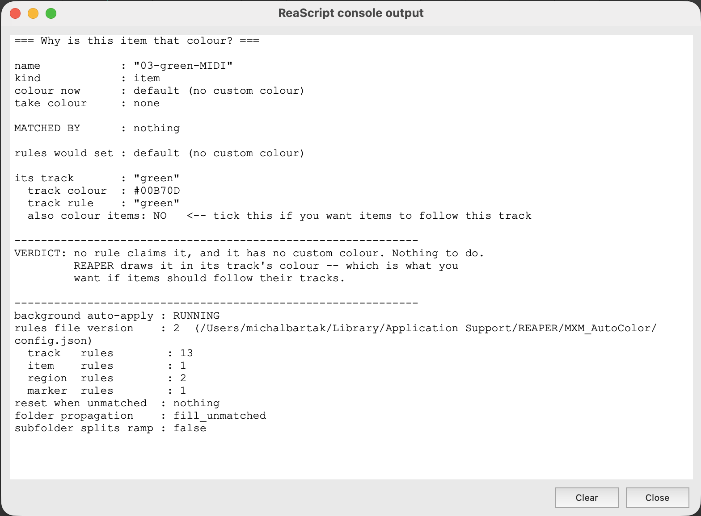

## Start here: why this colour?

Select the track or item and run `MXM_AutoColor_WhyThisColour.lua`. One console readout covers the whole question: which rule claimed the object, what the rules would set, whether anything is currently applying, and why an old colour survived.

<figure class="shot">

<figcaption>MXM_AutoColor_WhyThisColour.lua</figcaption>
</figure>

## Nothing visibly changed, but it says it coloured things

Almost always a REAPER display setting rather than the tool:

1. **Item colours are not drawn.** *Preferences → Appearance → Peaks/Waveforms* — tick **Item color** for background, peaks, or both. See [REAPER preferences](/Reaper-AutoColor/configuration/reaper-preferences/).
1. **A take colour is winning.** Take beats item. To confirm, give one item a custom colour and its take a different one; the visible one is what this build draws.
1. **The theme overrides it.** REAPER's own tooltip warns that a colour theme may override the tint preference.

## Colours keep changing back

SWS Auto Color is recolouring the same objects. A warning appears on each affected tab while it is on.

Switch one off — SWS's is under *SWS → Auto Color/Icon/Layout*. **Options ▸ Config file ▸ Import from SWS** moves them here first; see [Importing from SWS](/Reaper-AutoColor/configuration/import-sws/).

## A rule shows 0 hits

**Hits** counts what a rule *wins*, not what its pattern matches:

- An **earlier rule on the same tab** claimed those objects; move this one up.
- The mode is **glob** and the pattern is not wrapped in `*`. Globs are anchored to the whole name, so `bass` matches a track named exactly "bass". `*bass*`, or **contains**, is the fix.
- A **filter** is narrowing it. The filter and the pattern must both hold.
- The rule is **switched off**, or every rule on the tab is. The tab says so.

The **Pattern tester** at the foot of the window settles it: same mode, the pattern and the name pasted in, and it reports whether the pattern matches at all.

## "This pattern is too slow"

The pattern took too long and was stopped, to prevent REAPER from freezing; the rule is treated as a no-match. Nested quantifiers — `(a+)+$` and similar — are the usual cause.

## A hand-picked colour came back / did not come back

The background loop **never reverts a colour set by hand**. It leaves that object alone until the next rename.

**Apply now**, or `MXM_AutoColor_ApplyAll.lua`, returns every object to the rules.

## The Auto button says "off" and will not start

Run `MXM_AutoColor_AutoToggle.lua` once from the Action List. Until then the button only shows the state; after that it starts and stops the loop.

## An item or marker renamed in place did not recolour

An item, region or marker renamed in place is picked up after **Item/marker rescan (s)**, 5 s by default. Lower the interval, or press **Apply now**. See [Auto-apply](/Reaper-AutoColor/usage/auto-apply/#what-it-re-reads-and-when).

## A change to the scripts did nothing

The window and the auto-toggle hold their Lua state for as long as they run. After editing anything under `Scripts/MXM_AutoColor/lib/`:

1. Close the configuration window and re-run it.
1. Toggle auto **off and on** again.

One-shot actions pick up changes immediately.

## Marker and region colours will not clear

On REAPER older than **7.62**, marker and region colours cannot be cleared. Colouring still works, and the scripts report how many were skipped.

## The master track is never coloured

REAPER does not show a custom colour on the master track, set by this tool or by REAPER's own track-colour action, so it is not scanned at all.

## The rules are gone

Next to [`config.json`](/Reaper-AutoColor/configuration/config-file/):

| File | Meaning |
|---|---|
| `config.bak.json` | The previous version. Rename it over `config.json` with the window closed. |
| `config.bad.json` | The file was unreadable and was parked here rather than lost. |

The window also has **Undo** for rule changes, as long as it is still open.

## The window says nothing will be saved

A **newer** version of the tool wrote the config file. Editing is allowed, for inspection, but nothing is saved, to prevent an older version from overwriting a config it does not understand. Update the scripts.

## Diagnostics

| Script | What it reports |
|---|---|
| `MXM_AutoColor_WhyThisColour.lua` | For a selected track or item: which rule claimed it, what the rules would set, whether anything is applying, and why an old colour survived |
| `MXM_AutoColor_Dump.lua` | Every track, item, region and marker with its name, GUID and current colour |
| `MXM_AutoColor_RunTests.lua` | The self-test, printed to the ReaScript console |

For the background loop, ExtState `MXM_AutoColor` / `auto_debug` set to `1` reports to the console.

:::note[Probes that do not ship]
The repository's `dev/` folder holds a few more: a take-colour probe, a focus probe, and one that builds a scratch project covering the awkward cases. They are not shipped; clone the repository to use them.
:::

## Known limitations

* Case-insensitive matching folds **ASCII only** — `(?i)` will not equate `Č` and `č`. Byte classes do accept non-ASCII, so `\w+` matches `Kytara_hlavní`.
* A pattern that takes too long (`(a+)+$` and similar) is stopped — see [“This pattern is too slow”](#this-pattern-is-too-slow).
* On REAPER older than 7.62, marker and region colours cannot be cleared; colouring still works. See [Marker and region colours will not clear](#marker-and-region-colours-will-not-clear).
* The master track is never scanned or coloured, because REAPER does not show a custom colour on it. See [The master track is never coloured](#the-master-track-is-never-coloured).
* **No rules for takes.** Take names are derived from the track name and not updated when it is renamed, so take rules would duplicate track rules. Recording-pass auto-colour and take ranking already cover per-take colouring.
* **Takes are not coloured, they are cleared.** Colours are written to the **item**, and every take on it has its colour reset, because a take colour can hide the item's colour. Deliberate take colours and item colouring are incompatible. The `dev/` take-colour probe reports which of the two a setup displays.
* SWS Auto Color must not run at the same time — both recolour the same objects. The window warns while SWS's auto-colour is on. **Options ▸ Config file ▸ Import from SWS** brings its rules across first.

## Not implemented

There is **no filter or search box** over the rule list: precedence is the list order, and hiding rows would hide it. It would also break drag-to-reorder.
