<figure class="shot">

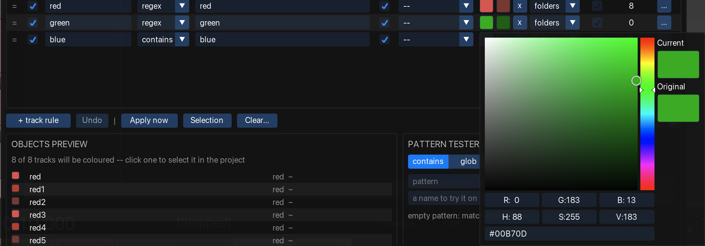

<figcaption>The Colour cell, with a second colour added</figcaption>
</figure>

In general colouring tracks follows a sequence:
1. Find tracks matching a **pattern** and a **filter**
1. Expand selection to folders (if configured)
1. If solid color is set to the rule, set solid color to all of them
1. If grandient is set to the rule, cover them by gradients
   - apply gradient splits based on settings

To better understand possible scenarios, following page visualizes most possible combos of settings.

:::note[Reading the diagrams]

| Element | Meaning |
|---|---|
| Square | One object (ie track). Its name reflects the colour a rule should give it. |
| Light grey square | No rule reached the track. |
| Banded square | One square for several cases with the same result. The dark band is a REAPER visual spacer, which is not a track. |
| Raised square | A track inside a folder. The track that opens the folder stays on the baseline. |
| Bracket | The extent of one folder. |
:::

## Solid fills

A rule with one colour writes that colour to every object it wins. Project order and the number of
matches make no difference.

<figure class="shot diagram">

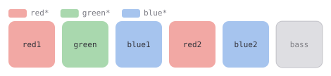

<figcaption>Three rules, three colours. <code>bass</code> matched nothing, so nothing is written to it.</figcaption>
</figure>

### Folders

A folder's colour can reach children that matched no rule of their own. Set this for the whole rule
set under **Options → Folders**.

| Setting | Effect |
|---|---|
| **fill gaps** *(default)* | Only unmatched children inherit. A child that matched its own rule keeps that colour. |
| **force** | The folder's colour overrides matched children too. |
| **off** | No inheritance. |

The diagrams below use one folder, `red`. Its children `green` and `blue` match rules of their own;
`bass` matches nothing.

<figure class="shot diagram">

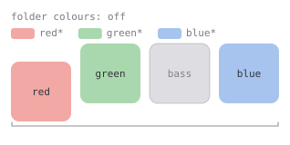

<figcaption><strong>off</strong>: nothing is written to <code>bass</code>.</figcaption>
</figure>

<figure class="shot diagram">

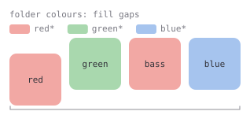

<figcaption><strong>fill gaps</strong>: only <code>bass</code> inherits.</figcaption>
</figure>

<figure class="shot diagram">

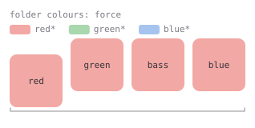

<figcaption><strong>force</strong>: the folder&rsquo;s rule takes the whole folder.</figcaption>
</figure>

See [folder colours](/Reaper-AutoColor/usage/colours/#folders) for which setting
to choose, and for what else is inherited.

## Gradients

A rule with two colours spreads the objects it wins evenly along a ramp between them. Objects
follow **project order**, and each kind ramps separately. Ten tracks matching one rule give ten
shades.

<figure class="shot diagram">

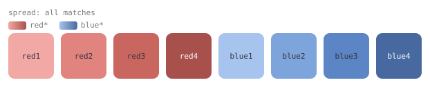

<figcaption>Two rules with two colours each. Every rule ramps over its own matches.</figcaption>
</figure>

### Spread across

Set how far one ramp reaches per rule, in the box beside the second colour.

<figure class="shot">

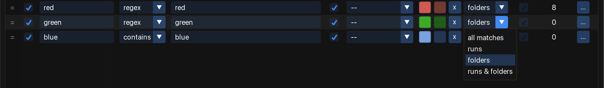

<figcaption>Spread the gradient across:</figcaption>
</figure>

| Spread across | One ramp covers |
|---|---|
| **all matches** | Every match in the project. |
| **runs** | One run: an unbroken stretch the rule wins. |
| **folders** | One folder. Tracks only. |
| **runs & folders** | Up to the next break or folder edge. Tracks only. |

The scopes differ as soon as something interrupts a stretch of matches.

<figure class="shot diagram">

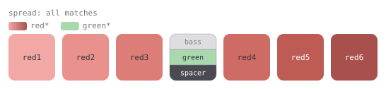

<figcaption><strong>all matches</strong>: one ramp over all six; the break is ignored.</figcaption>
</figure>

<figure class="shot diagram">

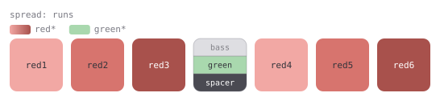

<figcaption><strong>runs</strong>: the break ends a run. Each side gets a full ramp.</figcaption>
</figure>

A run ends at anything the rule does not win:

- a track it matched nothing on;
- a track another rule won;
- a REAPER visual spacer.

A folder edge does not end a run. Use **folders** or **runs & folders** for that.

<figure class="shot diagram">

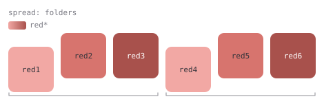

<figcaption><strong>folders</strong>: one ramp per folder. The track that opens the folder is the first step of its own ramp.</figcaption>
</figure>

### Subfolders

A nested folder can either end the color range or allow the gradient be applied to all tracks within top-level folder.

The behaviour is controlled by **Options → Folders → subfolder splits the parent's colour range** global setting.

If On (default), tracks after it start a new ramp instead of resuming the one before. A top-level folder does the same to the tracks around it.

If disabled, one ramp covers whole folder level, covering tracks before subfolders, and continuing the ramp after subfolder, however deep the nesting.

<figure class="shot diagram">

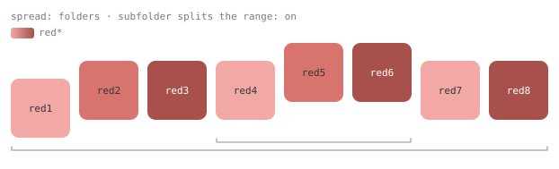

<figcaption>On: the tracks after the subfolder start again rather than resuming the ramp before it.</figcaption>
</figure>

<figure class="shot diagram">

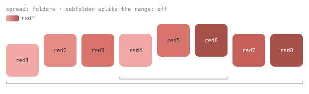

<figcaption>Off: the parent keeps one ramp across its own tracks; the subfolder still gets its own.</figcaption>
</figure>

:::caution[It can flatten a folder]
A range holding one track gets the **first** colour, because there is nothing for a ramp to spread
across. A folder that is mostly subfolders, with a single track between each, comes out one colour
throughout.

<figure class="shot diagram">

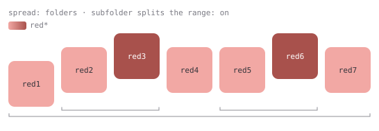

<figcaption>Five of these seven tracks are alone in their range, so five get the first colour.</figcaption>
</figure>

For such a layout, turn *subfolder splits the parent's colour range* off, or do not spread across
folders.
:::

An inherited range breaks the same way a flat one does. A child the rule does not win interrupts
it, and under a spread that counts **runs** that child splits the ramp in two.

<figure class="shot diagram">

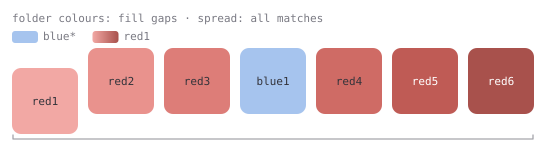

<figcaption><strong>all matches</strong>: <code>blue1</code> drops out, so the ramp has six steps instead of seven. It is not split.</figcaption>
</figure>

<figure class="shot diagram">

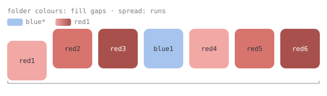

<figcaption><strong>runs</strong>: <code>blue1</code> ends a run, so <code>red1&ndash;red3</code> and <code>red4&ndash;red6</code> each get a full ramp.</figcaption>
</figure>

In both diagrams the rule's pattern is `red1`, the folder's own name. No child matches it, so every
child reaches the range by inheritance. `blue1` matches a rule of its own and stays out.

Two settings decide whether this happens at all:

- **Folders.** Under `force` the folder's rule wins every child, `blue1` included, so nothing interrupts the range.
  Under `off` nothing inherits, so there is no range to interrupt.
- **Spread across.** Only **runs** and **runs & folders** split the range. **all matches** and
  **folders** leave one ramp, one step shorter.

With a single folder, **runs & folders** gives the same picture as **runs**: there is no second
folder for the folder edge to act on.

:::caution[One combination still flattens a gradient]
Spread across **folders**, with an *is a folder track* filter and folder colours **off**. Nothing
reaches the children, so every parent is alone in its range and gets the first colour. The rule
warns about this.
:::

### Supported type of objects

| Kind | Default spread |
|---|---|
| Tracks | **runs** |
| Items | **runs** |
| Regions | **all matches** |
| Markers | **all matches** |

For items, a ramp never spans more than one track. Even **all matches** restarts on each track.

Regions and markers default to **all matches** because regions are usually interleaved —
`Verse, Chorus, Verse, Chorus`. A rule matching one of them rarely wins two in a row, so **runs**
would leave every range with one member and no visible gradient. Set them to **runs** where regions
do come in blocks.

### Costs

Both apply to gradients only. A solid fill writes one value to every match, whatever the project
layout.

- A gradient is **position dependent**. Inserting an object into a range reshuffles that range. A
  narrower spread limits the change to one range instead of every match, but each member then moves
  further, because the ranges are smaller. Edits at a boundary change membership: renaming the
  separating `Bus` to `String Bus` merges two ranges and recolours both.
- A gradient cannot be computed incrementally. A gradient rule aimed at **items** is expensive on
  very large projects.

## Items

REAPER decides an item's colour from the item itself:

- An item with **no colour of its own** is drawn in its **track's** colour, live. Move it to another
  track and it takes that track's colour at once.
- An item **with** a colour keeps it. Move it to another track and the colour goes with it.

Three settings decide which of the two an item is in.

| Setting | What it does to the item |
|---|---|
| **Items** on a track rule | Writes the track's colour onto every item on that track, whatever the item is called. REAPER then draws the item from that stored colour, not from the track it sits on. |
| A rule on the **Items** tab | Writes that rule's colour onto the item. |
| **Reset to the default colour when no rule matches**, ticked for items | Removes the item's colour, so REAPER draws it from the track again. |

The **Items** switch travels down folders with the colour, so a cascading folder rule also colours
the items on its child tracks.

Precedence for one item:

1. a rule on the **Items** tab, if one matches the item's take name;
1. otherwise its track's colour, if that track's rule has **Items** on;
1. otherwise nothing, unless the reset is ticked for items, which strips the colour.

The reset never touches an item that step 1 or step 2 claimed.

:::tip[For "items should look like their track", prefer the reset]
Both the **Items** switch and the reset make an item match its track today. They differ after a
move.

The switch leaves a stored colour on the item, so the item arrives on the new track still showing
the old one. An apply corrects it only if the new track's rule also has **Items** on. If it does
not, nothing corrects it.

The reset leaves the item with no colour, so REAPER draws it from whatever track it is on, with no
apply needed.

Use the **Items** switch when you want an item to differ from its track, or when your theme does not
tint item backgrounds by track colour.
:::

Whether any of this is visible depends on two
[REAPER preferences](/Reaper-AutoColor/configuration/reaper-preferences/).

### Takes

AutoColor writes colours to the **item**, never to a take. Writing a colour to an item also
**resets** the colour on every take it holds, because a custom take colour can hide the item's
colour entirely.

:::caution
If you colour takes deliberately, do not use this tool on items: it will clear those colours.
:::

There are no rules for takes.

## The master track

AutoColor never scans or colours the master track. REAPER does not honour a custom colour on it, not
through this tool and not through its own track-colour action.

## Where to go next

- [REAPER preferences](/Reaper-AutoColor/configuration/reaper-preferences/) — two settings that decide whether these colours are visible at all.
