Every rule on the **Tracks**, **Items**, **Regions** and **Markers** tabs has a colour. AutoColor gives that colour to the tracks, items, regions or markers that the rule matches. This page explains which colour each of them receives.

A rule can have one colour or two:

- With one colour, everything the rule matches receives that same colour.
- With two colours, the rule creates a *gradient*: a sequence of shades that changes step by step from the first colour to the second. Gradients make related tracks look like a group while keeping each track distinguishable.

Other settings on this page decide whether the tracks inside a folder also receive the folder track's colour, and how items get their colour.

The colours are written into the project when the rules are applied: with **Apply now** or **Selection** in the configuration window, with the apply actions, or automatically while auto-apply is running. See [Applying colours](/Reaper-AutoColor/usage/applying/).

In this documentation, *object* is the general word for a track, an item, a region or a marker.

<figure class="shot">

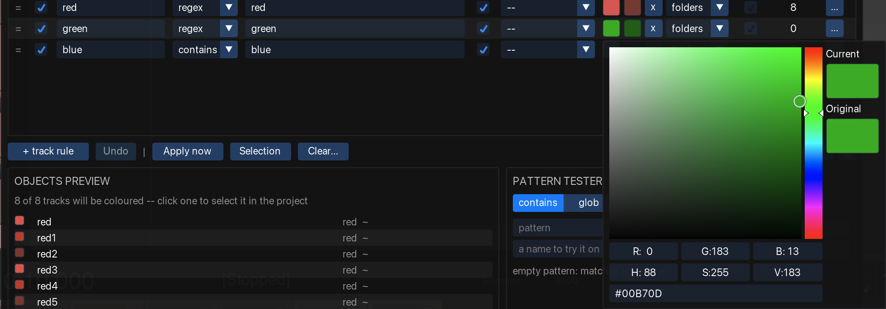

<figcaption>The Colour cell, with a second colour added</figcaption>
</figure>

## How a rule's colour is chosen

The **Colour** column of a rule holds its colour. To turn the rule into a gradient, click **+** beside the colour to add a second colour. To return to a single colour, click **x** beside the second colour.

When the rules are applied, AutoColor works out the colours for each rule in this order:

1. AutoColor finds the objects that the rule colours. These are the objects whose names match the rule's pattern and filter, and that no rule higher on the same tab has already matched. [Matching names](/Reaper-AutoColor/usage/matching/) explains patterns and filters.
1. For tracks, the [folder setting](#folders) can also give the rule's colour to the tracks inside a folder whose folder track the rule colours.
1. If the rule has one colour, every one of these objects receives it.
1. If the rule has two colours, the objects receive shades of a gradient. The rule's [spread setting](#spread-across) decides how the gradient is divided among them.

An object that no rule colours keeps the colour it already has, unless the option [Reset to the default colour when no rule matches](/Reaper-AutoColor/usage/clearing/#reset-to-the-default-colour-when-no-rule-matches) is on for its object type. Items have additional ways to get a colour; see [Items](#items).

The diagrams on this page show the result of different combinations of these settings.

:::note[Reading the diagrams]

| Element | Meaning |
|---|---|
| Square | One object, in these diagrams a track. Its name states the colour that the rules should give it. In the gradient diagrams, `red1`, `red2` and so on are successive shades of one red gradient. |
| Light grey square | A track that no rule colours. |
| Banded square | One square standing for several cases that produce the same result. The dark band stands for a REAPER visual spacer, which is not a track. |
| Raised square | A track inside a folder. The folder track, which opens the folder, stays on the baseline. |
| Bracket | The extent of one folder. |
:::

## One colour per rule

A rule with one colour gives that colour to every object it colours.

<figure class="shot diagram">

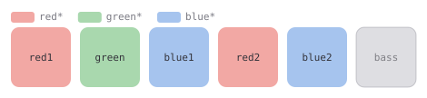

<figcaption>Three rules with one colour each. No rule matches <code>bass</code>, so AutoColor does not change its colour.</figcaption>
</figure>

### Folders

In REAPER, a folder track groups the tracks below it. The tracks inside the folder are its *children*. A folder can also contain other folders, called *subfolders*.

The folder setting decides whether a folder track's colour is also given to its children. It applies to all rules on the **Tracks** tab, and is set under **Options → Folders**. It has three values:

| Setting | Effect |
|---|---|
| **fill gaps** *(default)* | A child that no rule matches receives the folder track's colour. A child that a rule matches keeps the colour of that rule. |
| **force** | Every child receives the folder track's colour, including children that a rule matches. |
| **off** | Children never receive the folder track's colour. Each child is coloured only by the rule that matches it. |

For example, a rule colours the folder track `Drums` red, and another rule colours tracks named `Kick` orange. The folder contains the tracks `Kick` and `Room`, and no rule matches `Room`:

- With **fill gaps**, `Kick` is orange and `Room` is red.
- With **force**, both `Kick` and `Room` are red.
- With **off**, `Kick` is orange and `Room` keeps the colour it already has.

Choose **force** when each folder should appear as one block of colour, whatever the names inside it. Choose **off** when every track should be coloured only by its own name.

The folder setting applies only to colours. Icon rules have their own **Children** setting for each rule; see [Track icons](/Reaper-AutoColor/usage/icons/#children).

The diagrams below show one folder. The folder track is named `red`. Two of its children, `green` and `blue`, are matched by rules of their own. The third child, `bass`, is matched by no rule.

<figure class="shot diagram">

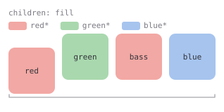

<figcaption><strong>fill gaps</strong>: only <code>bass</code> receives the folder&rsquo;s colour.</figcaption>
</figure>

<figure class="shot diagram">

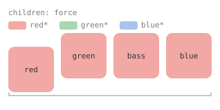

<figcaption><strong>force</strong>: the folder track&rsquo;s rule colours the whole folder.</figcaption>
</figure>

<figure class="shot diagram">

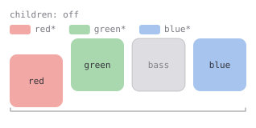

<figcaption><strong>off</strong>: AutoColor does not change the colour of <code>bass</code>.</figcaption>
</figure>

When folders are nested, the two settings behave as follows:

- With **fill gaps**, a child that no rule matches receives the colour of the innermost folder around it that has a colour. A folder has a colour when a rule matches its folder track, or when its folder track received a colour from a folder further out.
- With **force**, the outermost folder whose folder track has a colour gives that colour to everything inside it, including its subfolders.

## Gradients

A rule with two colours gives each object it colours a different shade between the two colours. This documentation calls one such sequence of shades a *ramp*.

Within one ramp:

- the first object receives exactly the first colour;
- the last object receives exactly the second colour;
- the objects in between receive evenly spaced shades.

The objects follow project order. Tracks are ordered from top to bottom. Items, regions and markers are ordered from left to right along the timeline. Each rule has its own ramps, and each tab is handled separately.

The shades in between are blended around the colour wheel, taking the shorter way. For example, a ramp from red to yellow passes through orange. If one of the two colours is grey, white or black, the ramp keeps the hue of the other colour and changes only its brightness and saturation.

A ramp that contains only one object gives that object the first colour, because there is nothing to spread the gradient across.

<figure class="shot diagram">

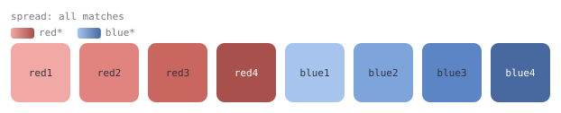

<figcaption>Two rules with two colours each. Each rule spreads its own ramp across the tracks it matches.</figcaption>
</figure>

### Spread across

A rule's matches are not always next to each other. Other tracks can sit between them, or they can be in different folders. The spread setting decides whether all of a rule's matches share one ramp, or whether the rule starts a new ramp at certain points. Each new ramp starts again from the first colour.

The spread setting is chosen per rule, in the box beside the second colour.

<figure class="shot">

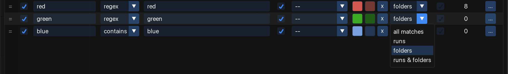

<figcaption>Spread the gradient across:</figcaption>
</figure>

Two of the values use the idea of a *run*. A run is an unbroken sequence of neighbouring objects that the rule colours. A run ends at any object that the rule does not colour:

- an object that no rule colours;
- an object that another rule colours;
- for tracks, a REAPER visual spacer.

The start or end of a folder does not end a run. To start a new ramp where a folder starts or ends, use **folders** or **runs & folders**.

| Spread across | One ramp covers | Available on |
|---|---|---|
| **all matches** | Every object the rule colours in the project | All tabs |
| **runs** | One run | All tabs |
| **folders** | The tracks the rule colours within one folder | Tracks only |
| **runs & folders** | One run, which also ends where a folder starts or ends | Tracks only |

The default depends on the tab:

| Tab | Default spread |
|---|---|
| Tracks | **runs** |
| Items | **runs** |
| Regions | **all matches** |
| Markers | **all matches** |

Regions and markers default to **all matches** because the regions of a song can alternate, for example `Verse`, `Chorus`, `Verse`, `Chorus`. With **runs**, a rule for `Verse` would then have one region in each run, and every region would receive the first colour. **runs** suits regions that follow each other in blocks.

On the **Items** tab, a ramp never continues from one track to the next. Each track's items get their own ramp, even with **all matches**.

The values give different results as soon as something interrupts a sequence of matches. In the two diagrams below, the fourth square stands for anything that interrupts the red tracks: a track that no rule colours, a track that another rule colours, or a visual spacer.

<figure class="shot diagram">

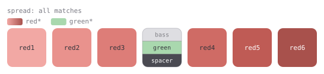

<figcaption><strong>all matches</strong>: one ramp covers all six red tracks. The interruption is ignored.</figcaption>
</figure>

<figure class="shot diagram">

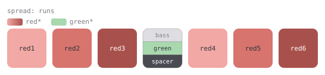

<figcaption><strong>runs</strong>: the interruption ends the first run. The tracks on each side receive a full ramp of their own.</figcaption>
</figure>

With **folders**, each folder has its own ramp. The folder track belongs to the folder it opens, so it receives the first shade of that folder's ramp. Tracks that are not inside any folder share a ramp of their own; [Subfolders](#subfolders) describes how folders at the top level divide those tracks.

<figure class="shot diagram">

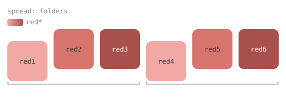

<figcaption><strong>folders</strong>: one ramp per folder. The folder track is the first step of its own folder&rsquo;s ramp.</figcaption>
</figure>

### Subfolders

The setting **Options → Folders → Subfolder splits the parent's colour range** decides how a subfolder affects the ramp of the folder around it. It applies to all rules that spread across **folders** or **runs & folders**. It has no effect on the other spread values.

In this section, a *range* is a group of tracks that share one ramp.

**On** (default): a subfolder divides the tracks of the folder around it. The tracks before the subfolder form one range. The tracks after it form a new range, which starts its ramp again from the first colour instead of continuing the earlier ramp. A folder at the top level divides the tracks outside folders in the same way.

**Off**: the tracks of a folder share one ramp, even when a subfolder sits between them. The tracks after the subfolder continue the ramp from where the tracks before it stopped. This applies at every level of nesting.

In both cases, the subfolder's own tracks get a separate ramp.

For example, a folder contains the tracks `Violin 1` and `Violin 2`, then a subfolder of violas, then the tracks `Cello` and `Double bass`. With the setting on, the two violins form one range and the cello and double bass form another, and both ramps start at the first colour. With the setting off, the four tracks share one ramp, which runs from the first violin to the double bass.

<figure class="shot diagram">

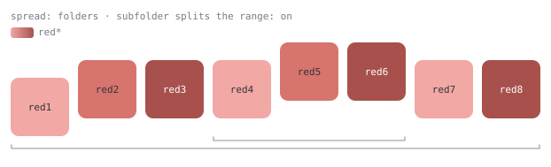

<figcaption>On: the tracks after the subfolder start a new ramp instead of continuing the ramp before it.</figcaption>
</figure>

<figure class="shot diagram">

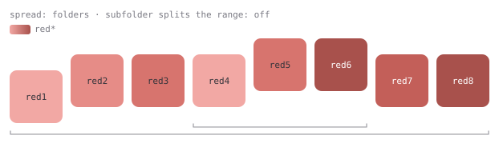

<figcaption>Off: the folder&rsquo;s own tracks share one ramp. The subfolder still gets its own ramp.</figcaption>
</figure>

:::caution[A folder made mostly of subfolders can end up in one colour]
With the setting on, a range that holds only one track gives that track the first colour. In a folder that consists mostly of subfolders, with single tracks between them, most ranges hold one track. Most of the tracks then receive the first colour.

<figure class="shot diagram">

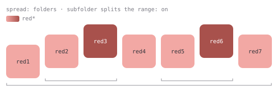

<figcaption>Three of these seven tracks are alone in their range, so they receive the first colour. The folder track of each subfolder also starts its own ramp with the first colour. Five of the seven tracks therefore receive the first colour.</figcaption>
</figure>

For a folder like this, turn **Subfolder splits the parent's colour range** off, or set the rule to spread across **all matches** or **runs**.
:::

### Gradients and folder colours

When a gradient rule matches a folder track, the [folder setting](#folders) can give the folder track's colour to its children as well. The children that receive the folder's colour in this way become part of the folder track's ramp. The ramp then spreads across the whole folder instead of giving every child the same colour.

The two diagrams below use the same folder. The rule's pattern is `red1`, which is the folder track's own name. No child matches this pattern, so every child that receives the red gradient receives it from the folder track. The child `blue1` matches a separate rule, `blue*`, and keeps its blue colour. The folder setting is **fill gaps**.

A child that the gradient rule does not colour, such as `blue1`, interrupts the folder's ramp in the same way as it would between tracks outside a folder. With **runs** or **runs & folders**, that child splits the ramp in two.

<figure class="shot diagram">

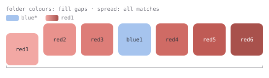

<figcaption><strong>all matches</strong>: <code>blue1</code> is left out, so the ramp has six steps instead of seven. The ramp is not split.</figcaption>
</figure>

<figure class="shot diagram">

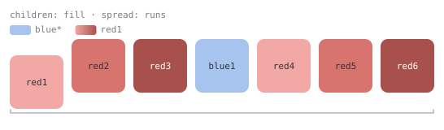

<figcaption><strong>runs</strong>: <code>blue1</code> ends a run, so <code>red1&ndash;red3</code> and <code>red4&ndash;red6</code> each receive a full ramp.</figcaption>
</figure>

Two settings decide whether a child such as `blue1` splits the ramp:

- **The folder setting.** With **force**, the folder track's rule colours every child, including `blue1`, so nothing interrupts the ramp. With **off**, no child receives the folder's colour, so the folder track has no ramp across its children at all.
- **The spread setting.** Only **runs** and **runs & folders** split the ramp. With **all matches** or **folders**, the ramp stays in one piece and is one step shorter.

With a single folder, as in these diagrams, **runs & folders** gives the same result as **runs**, because there is no second folder whose boundary could start a new ramp.

:::caution[One combination always gives the first colour]
This happens when all three of these settings are combined:

- the rule spreads across **folders** or **runs & folders**;
- the rule has the filter **is a folder track**;
- the folder setting is **off**.

The rule then colours only folder tracks, and none of their children. Each folder track is then the only track in its ramp, so every folder track receives the first colour. The window shows a warning below the rule list when such a rule is selected.
:::

### Limitations of gradients

These points apply to gradients only. A rule with one colour gives the same result wherever its objects are.

- The shade an object receives depends on its position in the ramp. Adding or removing an object inside a ramp changes the shades of the other objects in that ramp. With a spread setting that creates several smaller ramps, such as **runs**, the change affects only the ramp that contains the object.
- If an object that separates two runs is renamed so that the rule now colours it, the two runs join into one ramp.
- A gradient rule on the **Items** tab can be slow in very large projects. The window shows a warning when such a rule is selected.

## Items

In REAPER, an item is drawn in one of two ways:

- An item with **no colour of its own** is drawn in its **track's** colour. The item follows its track: if you move the item to another track, REAPER draws it in the new track's colour at once.
- An item **with a colour of its own** keeps that colour. If you move the item to another track, the colour moves with it.

AutoColor can put an item into either state. Three settings decide which:

| Setting | What it does to the item |
|---|---|
| A rule on the **Items** tab | Gives the item the colour of that rule. The rule matches the name of the item's active take. |
| The **Items** checkbox on a rule on the **Tracks** tab | Gives every item on the tracks that the rule colours the track's colour, whatever the items are called. The item then has a colour of its own, so REAPER no longer draws it from the track it sits on. |
| **Options → Scope → Reset to the default colour when no rule matches**, ticked for **Items** | Removes the colour from every item that the first two settings do not colour, so REAPER draws those items in their track's colour again. See [Reset to the default colour when no rule matches](/Reaper-AutoColor/usage/clearing/#reset-to-the-default-colour-when-no-rule-matches). |

For a single item, AutoColor checks these settings in order:

1. If a rule on the **Items** tab matches the item, the item receives that rule's colour.
1. Otherwise, if the item's track is coloured by a rule with **Items** ticked, the item receives the track's colour.
1. Otherwise, if the reset is ticked for **Items**, AutoColor removes the item's colour.
1. Otherwise, AutoColor leaves the item's colour unchanged.

The reset never affects an item that step 1 or step 2 colours.

The **Items** checkbox also applies to the children of a folder. If a track receives its colour from its folder track, and the folder track's rule has **Items** ticked, the items on that child track also receive the colour.

If a track rule with **Items** ticked has two colours, each track's items receive that track's shade of the gradient. All items on one track have the same colour.

:::tip[To make items look like their track, prefer the reset]
The **Items** checkbox and the reset both make an item show its track's colour as soon as the rules are applied. They differ when you later move the item to another track:

- With the reset, the item has no colour of its own. REAPER draws it in the new track's colour at once.
- With the **Items** checkbox, the item keeps the colour that was written to it. The next time the rules are applied, the item receives the new track's colour only if the new track's rule also has **Items** ticked.

The **Items** checkbox is useful when items should keep their colour after they move to another track, or when the REAPER theme does not tint items with their track's colour.
:::

Whether item colours are visible at all depends on two [REAPER preferences](/Reaper-AutoColor/configuration/reaper-preferences/).

### Takes

In REAPER, an item holds one or more takes, and each take can have a colour of its own. A take colour can hide the item's colour; [REAPER preferences](/Reaper-AutoColor/configuration/reaper-preferences/) explains which colour REAPER draws.

AutoColor writes colours to the **item**, never to a take. When AutoColor writes a colour to an item, it also removes the colour from every take in that item. This keeps a take colour from hiding the item colour. For the same reason, AutoColor writes the colour again to an item whose colour is already correct if the item's active take has a colour of its own.

:::caution
Take colours and AutoColor item colours cannot be combined. When AutoColor colours an item, it removes any take colours you set in that item. A take colour on an item that AutoColor does not colour stays in place.
:::

There are no rules for takes. When you record, REAPER names each take after the track, and it does not rename the take when you later rename the track. Rules for takes would therefore duplicate the rules for tracks. To colour individual takes, use REAPER's own options, such as colouring each recording pass.

To check whether your setup draws the take colour or the item colour, see the tip in [REAPER preferences](/Reaper-AutoColor/configuration/reaper-preferences/#automatic-take-colours).

## Where to go next

- [REAPER preferences](/Reaper-AutoColor/configuration/reaper-preferences/) — two REAPER settings that decide whether these colours are visible at all.
- [Matching names](/Reaper-AutoColor/usage/matching/) — how a rule decides which objects it colours.
