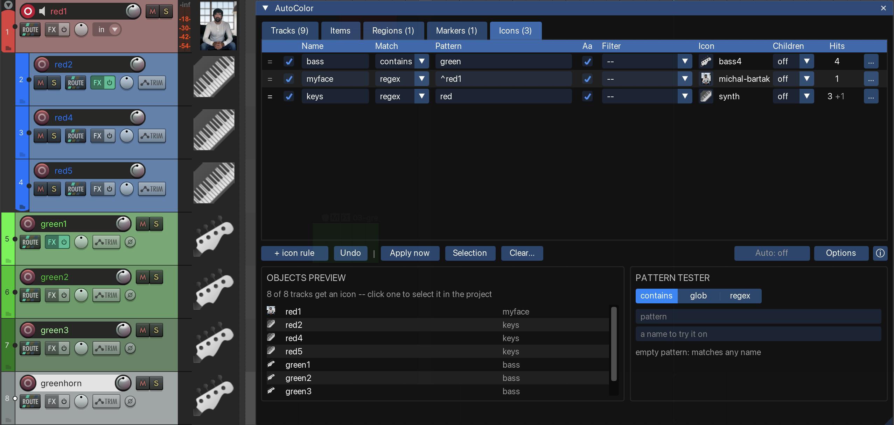
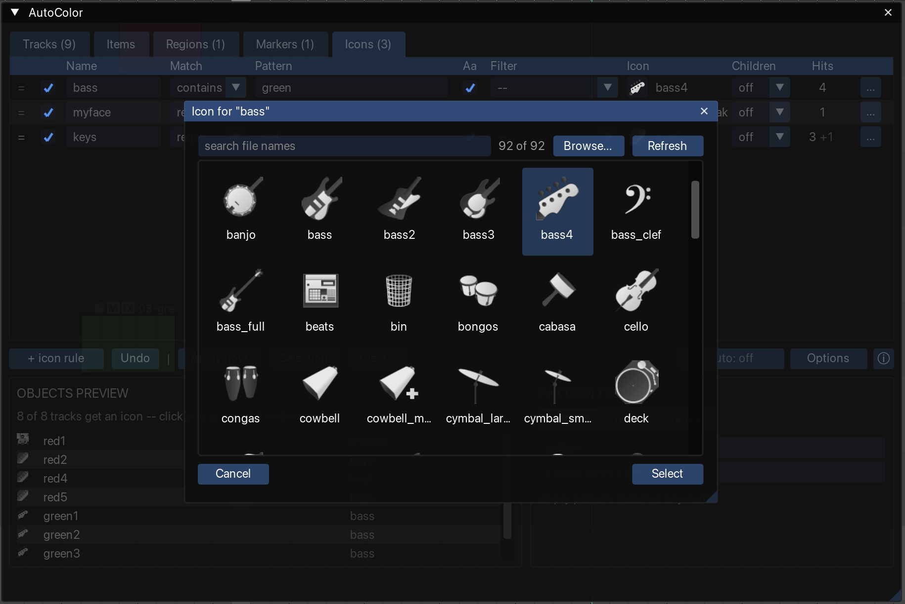

A track icon is the small image that REAPER can show on a track, in the track panel and the mixer. The **Icons** tab of the configuration window sets each track's icon from the track's name, in the same way that the **Tracks** tab sets each track's colour. For example, a rule can give every track whose name contains `vox` a microphone icon.

Use icon rules to make tracks easier to recognise at a glance, without choosing an icon for each track by hand.

## How icon rules are matched

The **Icons** tab holds a list of icon rules. Icon rules are matched in the same way as colour rules: the first rule in the list that matches a track sets its icon. See [Rules and matching](/Reaper-AutoColor/usage/matching/#rules-and-matching).

Icon rules match tracks only. Items, regions and markers have no icons.

The icon rules are separate from the colour rules on the **Tracks** tab. A track can take its colour from one rule and its icon from another. For example:

- On the **Tracks** tab, a rule matching `drum` colours the track red.
- On the **Icons** tab, a rule matching `kick` sets a kick drum icon.
- A track named `Drum Kick` is coloured red by the first rule and gets the kick drum icon from the second.

Icon rules take effect when the rules are applied, together with the colour rules. See [Applying colours](/Reaper-AutoColor/usage/applying/).

## Columns

Icon rules have the same **Name**, **Match**, **Pattern**, **Aa** and [**Filter**](/Reaper-AutoColor/usage/matching/#filters) columns as rules on the **Tracks** tab. In place of **Colour** and **Items**, they have two columns of their own:

| Column | What it does |
|---|---|
| **Icon** | The icon the rule sets. Click the thumbnail to open the icon browser. A rule whose icon is **None** removes the icon from the tracks it matches. |
| **Children** | What happens to the tracks inside a folder track that this rule matches. See [Children](#children). |

## The icon browser

The icon browser opens when you click the icon thumbnail in a rule. It shows every PNG and JPEG file in the `Data/track_icons` folder of the [REAPER resource folder](/Reaper-AutoColor/installation/#the-reaper-resource-folder), including its subfolders. The icons are sorted by their path.

- Type in the **search** field to show only icons whose file name contains the text. The name of the subfolder is included in the search, and case is ignored. For example, `drum` finds `kick.png` inside a `Drums` subfolder.
- Click an icon to mark it.
- Click **Select**, double-click the icon, or press `Enter` to give the marked icon to the rule.
- Click **Cancel** or press `Esc` to close the browser without changing the rule.
- **None**, the first cell when the search field is empty, removes the icon from the rule.
- **Browse…** lets you pick an image file from anywhere on disk.
- **Refresh** reads the `Data/track_icons` folder again. Use it after adding icon files while the browser is open.

An icon picked from inside `Data/track_icons` is saved in the rule relative to that folder. The [config file](/Reaper-AutoColor/configuration/config-file/) then still works on another computer that has the same icons in its own `Data/track_icons` folder. An icon picked from anywhere else is saved with its full path, so it works only where that path exists.

## Children

The **Children** setting decides whether a folder track passes its icon to the tracks inside it. The setting has an effect only when the rule matches a folder track. Each icon rule has its own **Children** setting.

| Setting | Effect |
|---|---|
| **off** (default) | Only the folder track gets the icon. |
| **fill** | Tracks inside the folder that no icon rule matches get the folder's icon. Tracks that an icon rule matches get the icon from that rule. |
| **force** | Every track inside the folder gets the folder's icon, even if an icon rule matches it. |

For example, a folder track named `Drums` contains the tracks `Kick`, `Snare` and `Room`. One icon rule matches `drums` and sets a drum kit icon. Another icon rule matches `kick` and sets a kick drum icon.

- With **off**, only `Drums` gets the drum kit icon. `Kick` gets the kick drum icon. `Snare` and `Room` get no icon from the rules.
- With **fill**, `Snare` and `Room` also get the drum kit icon. `Kick` keeps the kick drum icon.
- With **force**, all three tracks get the drum kit icon.

Folders inside folders follow these rules:

- If several nested folders use **force**, the tracks inside get the icon of the outermost folder.
- If an outer folder's rule uses **fill**, tracks inside a subfolder that no icon rule matches also get the outer folder's icon. This applies even when the subfolder's own rule has **Children** set to **off**.

Colours handle folders differently. For colours, one setting in [Options](/Reaper-AutoColor/configuration/#folders) applies to all rules. For icons, each rule has its own **Children** setting.

## Tracks without a matching rule

By default, a track that no icon rule matches keeps the icon it already has. To remove the icon from such tracks instead, turn on **Options → Scope → Reset to the default colour when no rule matches → Icons**. See [Reset to the default colour when no rule matches](/Reaper-AutoColor/usage/clearing/#reset-to-the-default-colour-when-no-rule-matches).

To remove icons once, use the **Clear…** menu on the **Icons** tab. It offers three choices: icons the rules match, icons on selected tracks, and every track icon in the project. See [Clearing track icons](/Reaper-AutoColor/usage/clearing/#clearing-track-icons).

## Icons set by hand

While [auto-apply](/Reaper-AutoColor/usage/auto-apply/) is running, it keeps an icon that you set by hand on a track, and **Apply now** replaces it with the icon from the matching rule. Icons and colours set by hand are handled the same way, and independently of each other. See [Colours and icons set by hand](/Reaper-AutoColor/usage/auto-apply/#colours-and-icons-set-by-hand).

## Limitations

- If a rule's icon file cannot be found, a warning appears below the rule list when the rule is selected.
- If SWS Auto Icon is enabled, the **Icons** tab shows a warning. See [Colours keep changing back](/Reaper-AutoColor/troubleshooting/#colours-keep-changing-back).

## Where to go next

- [Matching names](/Reaper-AutoColor/usage/matching/) — match modes and filters, shared with the other tabs.
- [Importing from SWS](/Reaper-AutoColor/configuration/import-sws/) — SWS Auto Icon rules can be imported as well.
