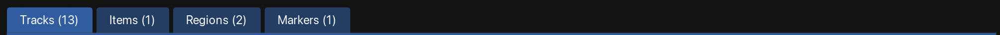
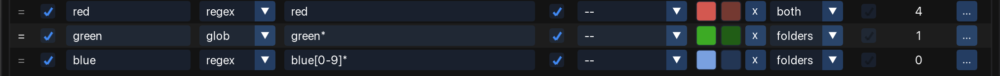
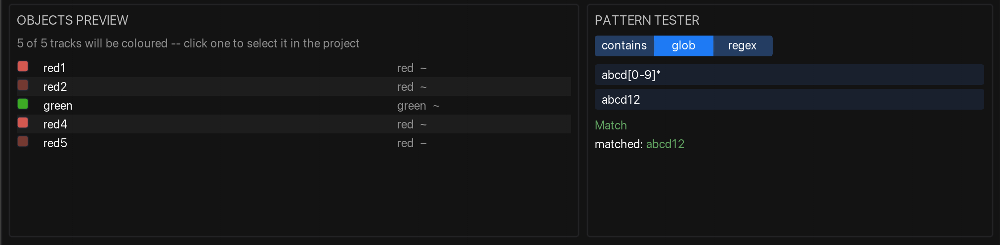

`MXM_AutoColor_GUI.lua` opens the one window the tool has. Everything is on it: the rules, what
they currently hit, and the buttons that put the colours into the project.

<figure class="shot">

<figcaption>The configuration window</figcaption>
</figure>

Edits are saved to the [rules file](/Reaper-AutoColor/configuration/rules-file/) as you make them —
there is no Save button. **Undo** (or `Cmd`/`Ctrl`+`Z` while the window has focus) steps back
through changes to the **rules**; colour changes in the project use REAPER's own undo.

## One tab per object kind

<figure class="shot">

<figcaption>Tracks, Items, Regions and Markers, with their rule counts</figcaption>
</figure>

Each tab holds its own ordered list, and within a tab **the first rule that matches wins**. Reorder
them to change precedence, exactly like firewall rules.

Precedence is **per tab**, so reordering your track rules can never change which region wins. Each
tab also offers only the controls that mean something for it: the folder filters exist on Tracks and
nowhere else.

## The rule row

<figure class="shot">

<figcaption>One rule, left to right</figcaption>
</figure>

| Column | What it is |
|---|---|
| handle | Drag to reorder. Click to highlight the rule — which is also where Objects preview points when you click a rule name in it. |
| on/off | Switch the rule off without deleting it. A tab whose rules are all off says so. |
| **Name** | Your label for the rule. Only ever shown in this window. |
| **Match** | `contains`, `glob` or `regex` — see [Matching names](/Reaper-AutoColor/usage/matching/). |
| **Pattern** | What to match. Leave it empty to match on the filter alone. |
| **Aa** | Ignore case (ASCII only). |
| **Filter** | An extra condition on top of the pattern — see [Filters](/Reaper-AutoColor/usage/matching/#filters). |
| **Colour** | The rule's colour, and optionally a [second one](/Reaper-AutoColor/usage/colours/#gradients) for a gradient. |
| **Items** | Tracks tab only: [also colour the items](/Reaper-AutoColor/usage/items-and-folders/) on the tracks this rule matches. |
| **Hits** | How many objects this rule currently wins in this project. |
| menu | Duplicate, Delete, and Move to top / up / down / bottom. |

:::tip[Hits reads 0 but objects are still coloured]
**Hits** counts what the rule *wins*, not what its pattern matches. An earlier rule that claimed the
same objects first leaves this one on 0 — move it up if it should win.
:::

## The preview panes

<figure class="shot">

<figcaption>Objects preview and Pattern tester</figcaption>
</figure>

**Objects preview** lists what the rules on the open tab actually claim in *this* project, resolved
first-match-wins by the same code that Apply runs — it is not an approximation. Each row carries the
colour it will get, the object's name, and which rule is responsible:

| The Rule column says | Meaning |
|---|---|
| a rule's name | That rule won it. Click to highlight the rule in the table. A trailing `~` means it is spreading a gradient. |
| `from track: …` | No item rule matched, so it takes its track's colour — that track's rule has *also colour items* on. |
| `from folder` | No rule of its own; it inherits its folder parent's colour. |

The list follows the open tab, and clicking a **name** reveals that object in the project.

**Pattern tester** is a scratch pad with its own mode, pattern and name to try them on. Type, and it
says whether it matches, which part of the name it matched, and what each group captured.

:::tip[It knows nothing about your rules]
That is the point. Testing the *selected rule* meant you could not try anything out without first
committing it to a rule — and editing a rule to experiment is the very thing you want to avoid.
Nothing you type here is saved, and nothing it does reaches the project.
:::

## The action bar

<figure class="shot">

<figcaption>The action bar, below the rule table</figcaption>
</figure>

| Button | What it does |
|---|---|
| **+ *kind* rule** | Adds a rule to the open tab. |
| **Undo** | Steps back through changes to the rules. |
| **Apply now** | Colours the whole project, in one undo point. See [Applying colours](/Reaper-AutoColor/usage/applying/). |
| **Selection** | Colours only what is selected. |
| **Clear…** | Three clearing scopes — see [Clearing colours](/Reaper-AutoColor/usage/clearing/). |
| **Auto: off / on / paused** | The state of the background loop, and a Pause button once it runs. See [Auto-apply](/Reaper-AutoColor/usage/auto-apply/). |
| **Options** | Folders, scope, the background loop's timing, text size, rules file. See [Options](/Reaper-AutoColor/configuration/). |
| **ⓘ** | About — the version you are running, links to the source and these docs, the author, and the licence. |

The foot of the window keeps one line for status messages — what an Apply coloured, why a clear did
nothing, whether a save failed. It is always there, whether or not it has anything to say, so the
layout never jumps.

## Banners

Two conditions are reported at the top of the window rather than in passing:

- **SWS Auto Color is enabled** — both are live colour engines and they will fight. Switch one off;
  see [Troubleshooting](/Reaper-AutoColor/troubleshooting/#colours-keep-changing-back).
- **This rule file was written by a newer version** — editing is allowed, but nothing will be saved,
  so an older build cannot quietly destroy a config it does not understand.

## Where to go next

- [Matching names](/Reaper-AutoColor/usage/matching/) — the three modes, the supported regex, the filters.
- [Colours and gradients](/Reaper-AutoColor/usage/colours/) — one colour, two colours, and what a ramp spreads across.
- [Applying colours](/Reaper-AutoColor/usage/applying/) — Apply now, Selection, and the actions that do the same without the window.
