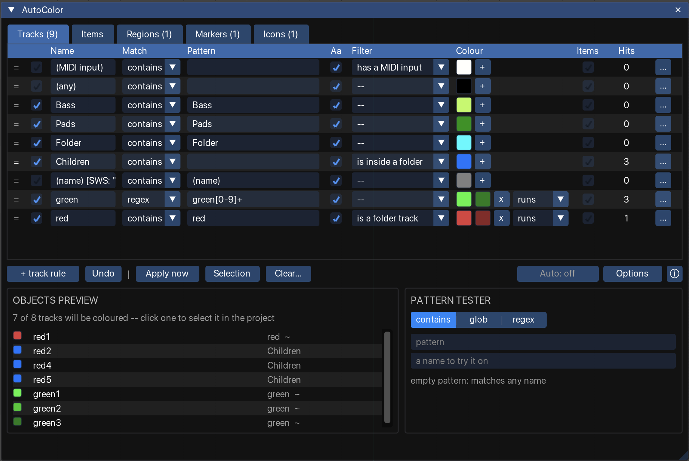
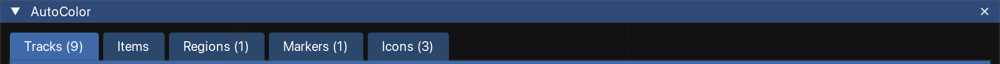
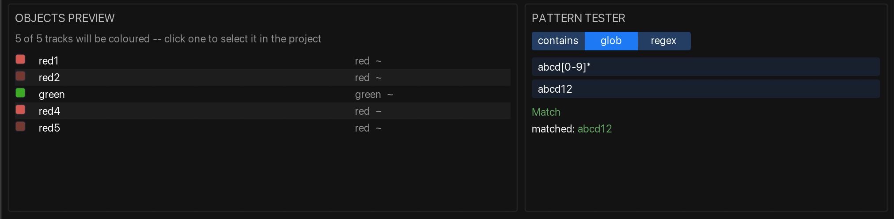

The configuration window is where you create and edit AutoColor's rules. A rule tells AutoColor which colour, or which track icon, to give to tracks, items, regions or markers whose names match a pattern. On this page, *object* means any track, item, region or marker. The window also shows a preview of what the rules will do in the current project, and has the buttons that apply the rules to the project.

To open the window, run the action `MXM_AutoColor_GUI.lua`, or click its toolbar button. If the window does not open, see [Requirements](/Reaper-AutoColor/requirements/).

<figure class="shot">

<figcaption>The configuration window</figcaption>
</figure>

The window has four parts, from top to bottom:

- **The tabs**, one for each object type. Each tab holds the rule list for that object type.
- **The action bar**, with the buttons that add rules, apply them, clear colours, and open the options.
- **The preview panes**: *Objects preview* shows what the rules match in the current project, and *Pattern tester* lets you try out a pattern on a name.
- **The status line**, at the bottom, which shows the result of the last action.

## Saving and undo

There is no Save button. AutoColor saves every change to the rules automatically, shortly after you make it, to the [config file](/Reaper-AutoColor/configuration/config-file/). While a save is pending, `saving...` appears on the action bar.

The **Undo** button on the action bar reverts the last change to the rules. `Cmd`+`Z` on macOS, or `Ctrl`+`Z` on Windows and Linux, does the same while the window has focus. The undo history is kept only while the window is open.

Colours written into the project are not part of this undo history. To revert them, use REAPER's own Undo.

## The tabs

<figure class="shot">

<figcaption>The tabs, with their rule counts</figcaption>
</figure>

The window has one tab for each thing that AutoColor can set. When a tab has rules, the number of rules is shown in its label, for example `Tracks (12)`.

| Tab | Sets | Described in |
|---|---|---|
| **Tracks** | Track colours | [Track colours](/Reaper-AutoColor/usage/tracks/) |
| **Items** | Item colours | [Item colours](/Reaper-AutoColor/usage/items/) |
| **Regions** | Region colours | [Region colours](/Reaper-AutoColor/usage/regions/) |
| **Markers** | Marker colours | [Marker colours](/Reaper-AutoColor/usage/markers/) |
| **Icons** | Track icons | [Track icons](/Reaper-AutoColor/usage/icons/) |

Each tab holds an ordered list of rules for its own object type. Rules on one tab never affect objects of another type.

## Editing rules

<figure class="shot">

<figcaption>Rules on the Tracks tab</figcaption>
</figure>

Each row in the list is one rule. The columns that decide what a rule matches and what it sets are described on the page for each tab. The following parts of a row work the same on every tab:

- **+ *type* rule** on the action bar adds a rule at the bottom of the open tab, for example **+ track rule** on the Tracks tab. A new rule has an empty pattern and no filter, so it matches every object on its tab that no earlier rule matches.
- The handle at the left of the row moves the rule when you drag it up or down. Clicking the handle selects the rule.
- The checkbox next to the handle switches the rule off without deleting it. A rule that is switched off is skipped.
- **Name** is a label for the rule. The label is shown only in this window and does not affect matching.
- The **...** menu at the right of the row has **Move up**, **Move down**, **Move to top**, **Move to bottom**, **Duplicate** and **Delete**.

The order of the rules matters: the first rule that matches an object decides its colour or icon. See [Rules and matching](/Reaper-AutoColor/usage/matching/#rules-and-matching).

### Notes below the list

Some notes appear below the rule list:

- A warning when SWS Auto Color, or SWS Auto Icon on the Icons tab, is switched on for this object type and the tab has rules. See [Warnings](#warnings).
- A note when every rule on the tab is switched off.
- Notes about the selected rule, when there is something to point out. For example, a rule with an empty pattern and no filter shows that it matches every object on its tab.

## The preview panes

<figure class="shot">

<figcaption>Objects preview and Pattern tester</figcaption>
</figure>

### Objects preview

**Objects preview** lists the objects of the open tab's type that the rules will colour in the current project. The list shows exactly what applying the rules would do, before anything is applied. The heading says how many objects will be coloured out of how many there are. The list shows at most 500 objects.

Each row shows the colour the object will get, the object's name, and where the colour comes from:

| The Rule column shows | Meaning |
|---|---|
| a rule's name | That rule colours the object. If the rule has no name, its pattern is shown instead. A `~` after the name means the rule has two colours and gives each object a shade of a gradient. Click the rule's name to select the rule in the list above. |
| `from track: …` | The object is an item that no item rule matches. It takes the colour of its track, because the track's rule has **Items** switched on. |
| `from folder` | No rule matches the track. It takes the colour of its folder track; see [Folders](/Reaper-AutoColor/usage/colours/#folders). |

Click an object's name to find it in the project. A track is selected and scrolled into view. An item is selected. For a region or marker, the edit cursor moves to its position.

### Pattern tester

**Pattern tester** lets you try out a pattern on a name before you put the pattern in a rule. See [Testing a pattern](/Reaper-AutoColor/usage/matching/#testing-a-pattern).

## The action bar

<figure class="shot">

<figcaption>The action bar, below the rule table</figcaption>
</figure>

| Button | What it does |
|---|---|
| **+ *type* rule** | Adds a rule at the bottom of the open tab. |
| **Undo** | Reverts the last change to the rules. |
| **Apply now** | Applies all rules to the whole project. See [Applying colours and icons](/Reaper-AutoColor/usage/applying/). |
| **Selection** | Applies the rules to the selected objects only. See [Applying colours and icons](/Reaper-AutoColor/usage/applying/). |
| **Clear...** | Removes colours, or on the Icons tab track icons. See [Clearing colours](/Reaper-AutoColor/usage/clearing/). |
| **Auto: off** / **Auto: on** | Shows whether auto-apply is on, and switches it on or off. When auto-apply is on, AutoColor applies the rules automatically as objects are added or renamed. See [Auto-apply](/Reaper-AutoColor/usage/auto-apply/). |
| **Options** | Opens the options: folder colours, resetting the colour of objects that no rule matches, starting auto-apply with REAPER, auto-apply timing, text size, and the config file. See [Options](/Reaper-AutoColor/configuration/). |
| **ⓘ** | Shows the installed version, links to the source code and this documentation, the author, and the licence. |

## The status line

The line at the bottom of the window shows the result of the last action for a few seconds. For example, it shows how many objects **Apply now** coloured, `Already up to date.` when nothing needed to change, `Nothing is selected.` when **Selection** had nothing to work on, or an error if the rules could not be saved.

## Warnings

The window shows a warning in two situations:

- **SWS Auto Color or SWS Auto Icon is switched on.** The warning appears below the rule list of each affected tab that has rules, because SWS and AutoColor would overwrite each other's colours or icons. See [Colours keep changing back](/Reaper-AutoColor/troubleshooting/#colours-keep-changing-back).
- **This config file was written by a newer version.** The warning appears at the top of the window. Changes to the rules are not saved until you update AutoColor. See [Version handling](/Reaper-AutoColor/configuration/config-file/#version-handling).

## Where to go next

- [Track colours](/Reaper-AutoColor/usage/tracks/), and the pages for the other tabs: what the rules on each tab do.
- [Applying colours and icons](/Reaper-AutoColor/usage/applying/): **Apply now**, **Selection**, and the actions that do the same without opening the window.
