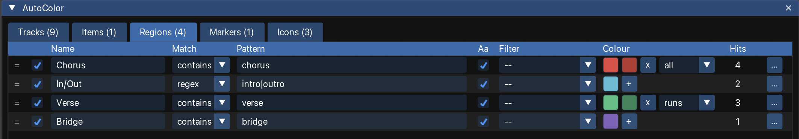

The **Regions** tab of the configuration window colours regions according to their names. For example, a rule can colour every region whose name contains `chorus` yellow, so that the song structure is visible at a glance.

<figure class="shot">

<figcaption>Rules on the Regions tab</figcaption>
</figure>

## Region rules

Each row on the **Regions** tab is one rule. A rule says which regions it matches and what colour they get:

| Column | What it does |
|---|---|
| **Match** | How the pattern is compared with the region name: `contains` (default), `glob` or `regex`. See [Match modes](/Reaper-AutoColor/usage/matching/#match-modes). |
| **Pattern** | The text to look for in the region name. An empty pattern matches every name. |
| **Aa** | On by default: upper and lower case are ignored. |
| **Filter** | Only one filter is available for regions: *has no name*. See [Filters](/Reaper-AutoColor/usage/matching/#filters). |
| **Colour** | The colour the matching regions get. Click **+** to add a second colour, which spreads a [gradient](/Reaper-AutoColor/usage/colours/#gradients) across the regions. |
| **Hits** | How many regions this rule colours in the current project. See [The Hits column](/Reaper-AutoColor/usage/matching/#the-hits-column). |

To add a rule, click **+ region rule** on the action bar. [Common controls](/Reaper-AutoColor/usage/#common-controls) describes how to reorder, duplicate and delete rules.

## Which rule colours a region

AutoColor compares each region name with the rules from top to bottom. The first rule that matches colours the region. Rules further down the list do not affect that region. To give a rule priority over another, move it higher in the list.

A region gradient runs from left to right along the timeline. By default, one gradient covers every region the rule colours, even when regions of other names lie between them. For example, with one rule for `verse` and another for `chorus`, the regions `Verse 1`, `Chorus 1`, `Verse 2` and `Chorus 2` get two gradients: one across the verses and one across the choruses. To start a new gradient after each interruption instead, see [Spread across](/Reaper-AutoColor/usage/colours/#spread-across).

## When regions are coloured

Editing a rule does not change the project. AutoColor writes the colours into the project when the rules are applied:

- **Apply now** colours every region in the project. One undo reverts the whole change.
- **Selection** colours only the selected regions.
- While [auto-apply](/Reaper-AutoColor/usage/auto-apply/) is running, a new region is coloured as soon as you stop editing. A renamed region is coloured within a few seconds; see [How quickly changes are applied](/Reaper-AutoColor/usage/auto-apply/#how-quickly-changes-are-applied).

AutoColor does not remove colours unless you ask it to. To remove colours, use [Clear](/Reaper-AutoColor/usage/clearing/), or the option [Reset to the default colour when no rule matches](/Reaper-AutoColor/usage/clearing/#reset-to-the-default-colour-when-no-rule-matches).

While auto-apply is running, a colour that you set by hand stays until you rename the region or click **Apply now**. See [Colours and icons set by hand](/Reaper-AutoColor/usage/auto-apply/#colours-and-icons-set-by-hand).

[Applying colours and icons](/Reaper-AutoColor/usage/applying/) describes the apply buttons and actions in full.

## Limitations

On REAPER older than 7.62, **Selection** leaves regions unchanged, and region colours cannot be removed. See [REAPER versions before 7.62](/Reaper-AutoColor/requirements/#reaper-versions-before-762).
