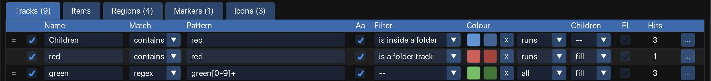

The **Tracks** tab of the configuration window colours tracks according to their names. For example, a rule can colour every track whose name contains `vox` green. You write the rules once, and AutoColor colours every matching track in the project.

<figure class="shot">

<figcaption>Three rules on the Tracks tab</figcaption>
</figure>

## Track rules

Each row on the **Tracks** tab is one rule. A rule says which tracks it matches and what colour they get:

| Column | What it does |
|---|---|
| **Match** | How the pattern is compared with the track name: `contains` (default), `glob` or `regex`. See [Match modes](/Reaper-AutoColor/usage/matching/#match-modes). |
| **Pattern** | The text to look for in the track name. An empty pattern matches every name. |
| **Aa** | On by default: upper and lower case are ignored, so `vox` matches `Vox` and `VOX`. |
| **Filter** | An optional condition that does not depend on the name, such as *is a folder track* or *has an instrument*. See [Filters](/Reaper-AutoColor/usage/matching/#filters). |
| **Colour** | The colour the matching tracks get. Click **+** to add a second colour, which spreads a [gradient](/Reaper-AutoColor/usage/colours/#gradients) across the tracks. |
| **Children** | Whether the tracks inside a folder track that this rule colours also get its colour. See [Folders](#folders). |
| **FI** | *Force item colour*. Off by default - items that have default color set, inherit the track colour. When on, the track's colour is written into the items on the matching tracks as their own colour. See [Items in their track's colour](#items-in-their-tracks-colour). |
| **Hits** | How many tracks this rule colours in the current project. See [The Hits column](/Reaper-AutoColor/usage/matching/#the-hits-column). |

To add a rule, click **+ track rule** on the action bar. [Common controls](/Reaper-AutoColor/usage/#common-controls) describes how to reorder, duplicate and delete rules.

## Which rule colours a track

AutoColor compares each track name with the rules from top to bottom. The first rule that matches colours the track. Rules further down the list do not affect that track.

For example, with these two rules in this order:

1. `kick` gives red.
1. `drum` gives orange.

A track named `Drum Kick` is red, because the `kick` rule comes first. A track named `Drum Room` is orange. To give a rule priority over another, move it higher in the list.

A track that no rule matches keeps the colour it already has, unless it takes the colour of its folder track, as described in the next section.

## Folders

By default, a track inside a folder that no rule matches gets the colour of its folder track. For example, if a rule colours the folder track `Drums` red, a track `Room` inside that folder is red too, even though no rule matches `Room`.

The **Children** setting of the rule that colours the folder track decides this. 
*  **--** (the default), inherits value of  **Options → Folders → Tracks** global setting
* **fill** spreads the color of matched track into its children that have no any color set yet
* **force** gives every track inside the folder the folder's colour, 
* **off** does nothing to children

[Folders](/Reaper-AutoColor/usage/colours/#folders) explains applying colors and color ranges with details.

## Items in their track's colour

REAPER draws an item in its track's colour when the item has no colour of its own. This depends on REAPER's item tinting preferences; see [REAPER preferences](/Reaper-AutoColor/configuration/reaper-preferences/). In that case the items on a coloured track show the track's colour without any setting in AutoColor.

Two settings change the items' own colour:

- The option [Reset to the default colour when no rule matches](/Reaper-AutoColor/usage/clearing/#reset-to-the-default-colour-when-no-rule-matches), ticked for **Items**, removes the colour from items that no rule colours, so REAPER draws them in their track's colour.
- The **FI** (force item colour) switch on a track rule writes the track's colour into every item on the matching tracks, as the item's own colour.

The two differ when an item is later moved to another track. [Items and their track's colour](/Reaper-AutoColor/usage/items/#items-and-their-tracks-colour) compares them.

## When tracks are coloured

Editing a rule does not change the project. AutoColor writes the colours into the project when the rules are applied:

- **Apply now** colours every track in the project. One undo reverts the whole change.
- **Selection** colours only the selected tracks.
- While [auto-apply](/Reaper-AutoColor/usage/auto-apply/) is running, a track is coloured as soon as it is added or renamed.

AutoColor does not remove colours unless you ask it to. To remove colours, use [Clear](/Reaper-AutoColor/usage/clearing/), or the option [Reset to the default colour when no rule matches](/Reaper-AutoColor/usage/clearing/#reset-to-the-default-colour-when-no-rule-matches).

While auto-apply is running, a colour that you set by hand stays until you rename the track or click **Apply now**. See [Colours and icons set by hand](/Reaper-AutoColor/usage/auto-apply/#colours-and-icons-set-by-hand).

[Applying colours and icons](/Reaper-AutoColor/usage/applying/) describes the apply buttons and actions in full.

## Limitations

- The master track is never coloured. See [The master track is never coloured](/Reaper-AutoColor/troubleshooting/#the-master-track-is-never-coloured).
- Track colours and track icons have separate rules. To set track icons, see [Track icons](/Reaper-AutoColor/usage/icons/).
